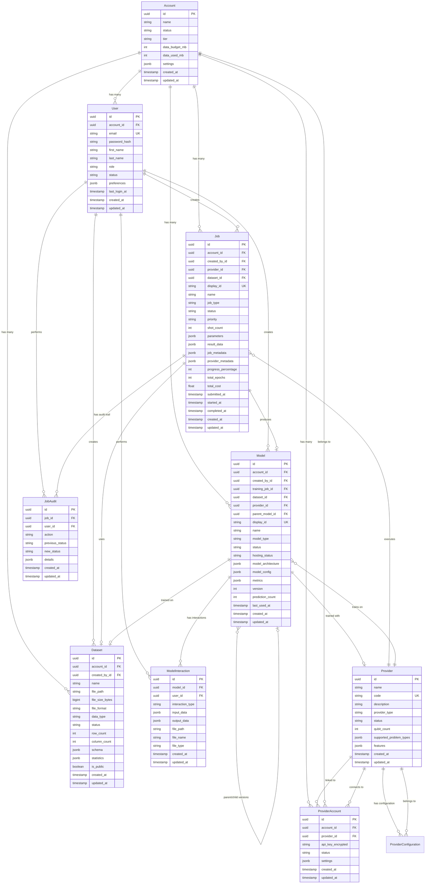

# QuantumCue Data Architecture

## Table of Contents

1. [Overview](#overview)
2. [Database Technology](#database-technology)
3. [Entity Relationship Diagram](#entity-relationship-diagram)
4. [Data Dictionary](#data-dictionary)
5. [Enumerations](#enumerations)
6. [Relationships Summary](#relationships-summary)
7. [Indexes](#indexes)

---

## Overview

QuantumCue uses a PostgreSQL 15 database with SQLAlchemy 2.0+ (async) as the ORM. The database follows a multi-tenant architecture where all resources are scoped to `Account` entities. The architecture supports:

- **Multi-tenancy**: All resources belong to an Account
- **User Management**: Role-based access control (Admin/User)
- **Quantum Job Execution**: Job lifecycle management with status tracking
- **Provider Integration**: Support for multiple quantum computing providers
- **Dataset Management**: Upload and management of training datasets
- **Model Management**: Trained quantum ML models with hosting capabilities
- **Audit Trail**: Comprehensive logging of job and model interactions

### Key Design Principles

- **UUID Primary Keys**: All tables use UUID primary keys for distributed system compatibility
- **Soft Deletes**: Timestamps (`created_at`, `updated_at`) on all entities
- **JSONB Flexibility**: Extensive use of JSONB for flexible metadata storage
- **Enum Types**: PostgreSQL ENUMs for type safety and validation
- **Cascade Deletes**: Proper foreign key cascading for data integrity
- **Display IDs**: Human-readable IDs (e.g., `QC-2025-00001`) alongside UUIDs

---

## Database Technology

- **Database**: PostgreSQL 15
- **ORM**: SQLAlchemy 2.0+ (async)
- **Migrations**: Alembic
- **Driver**: asyncpg
- **Connection Pooling**: SQLAlchemy async engine

---

## Entity Relationship Diagram



---

## Data Dictionary

### accounts

**Description**: Multi-tenant account/organization entity. All resources belong to an account.

| Field | Type | Constraints | Description |
|-------|------|-------------|-------------|
| `id` | UUID | PRIMARY KEY | Unique identifier |
| `name` | VARCHAR(255) | NOT NULL | Account/organization name |
| `status` | ENUM | NOT NULL, DEFAULT 'active' | Account status: `active`, `suspended`, `cancelled` |
| `tier` | ENUM | NOT NULL, DEFAULT 'free' | Account tier: `free`, `starter`, `professional`, `enterprise` |
| `data_budget_mb` | INTEGER | NOT NULL, DEFAULT 1024 | Data storage budget in megabytes |
| `data_used_mb` | INTEGER | NOT NULL, DEFAULT 0 | Current data usage in megabytes |
| `settings` | JSONB | NOT NULL, DEFAULT {} | Flexible account settings and preferences |
| `created_at` | TIMESTAMP WITH TIME ZONE | NOT NULL | Creation timestamp |
| `updated_at` | TIMESTAMP WITH TIME ZONE | NOT NULL | Last update timestamp |

**Relationships**:
- One-to-Many: `users`, `jobs`, `datasets`, `models`, `provider_accounts`

**Indexes**:
- Primary key on `id`

---

### users

**Description**: User accounts for authentication and authorization. Users belong to an Account.

| Field | Type | Constraints | Description |
|-------|------|-------------|-------------|
| `id` | UUID | PRIMARY KEY | Unique identifier |
| `account_id` | UUID | FOREIGN KEY → accounts.id, NOT NULL, INDEX | Account this user belongs to |
| `email` | VARCHAR(255) | UNIQUE, NOT NULL, INDEX | User email address (login) |
| `password_hash` | VARCHAR(255) | NOT NULL | Bcrypt hashed password |
| `first_name` | VARCHAR(100) | NULLABLE | User's first name |
| `last_name` | VARCHAR(100) | NULLABLE | User's last name |
| `role` | ENUM | NOT NULL, DEFAULT 'user' | User role: `admin`, `user` |
| `status` | ENUM | NOT NULL, DEFAULT 'active' | User status: `active`, `inactive`, `pending` |
| `preferences` | JSONB | NOT NULL, DEFAULT {} | User preferences (theme, notifications, etc.) |
| `last_login_at` | TIMESTAMP WITH TIME ZONE | NULLABLE | Last login timestamp |
| `created_at` | TIMESTAMP WITH TIME ZONE | NOT NULL | Creation timestamp |
| `updated_at` | TIMESTAMP WITH TIME ZONE | NOT NULL | Last update timestamp |

**Relationships**:
- Many-to-One: `account`
- One-to-Many: `jobs` (as creator), `datasets` (as creator), `models` (as creator), `model_interactions`, `job_audits`

**Indexes**:
- Primary key on `id`
- Unique index on `email`
- Index on `account_id`

**Computed Properties**:
- `full_name`: Returns first_name + last_name or email if names not set
- `is_admin`: Returns True if role is 'admin'
- `is_active`: Returns True if status is 'active'

---

### providers

**Description**: Quantum computing provider information and specifications.

| Field | Type | Constraints | Description |
|-------|------|-------------|-------------|
| `id` | UUID | PRIMARY KEY | Unique identifier |
| `name` | VARCHAR(255) | NOT NULL | Provider name (e.g., "D-Wave Systems") |
| `code` | VARCHAR(50) | UNIQUE, NOT NULL, INDEX | Provider code (e.g., "dwave") |
| `description` | TEXT | NULLABLE | Provider description |
| `logo_url` | VARCHAR(500) | NULLABLE | Provider logo URL |
| `website_url` | VARCHAR(500) | NULLABLE | Provider website URL |
| `documentation_url` | VARCHAR(500) | NULLABLE | Provider documentation URL |
| `provider_type` | ENUM | NOT NULL | Technology type: `quantum_annealer`, `gate_based`, `photonic`, `trapped_ion`, `superconducting`, `neutral_atom` |
| `technology_name` | VARCHAR(255) | NULLABLE | Specific technology name |
| `technology_description` | TEXT | NULLABLE | Technology description |
| `qubit_count` | INTEGER | NULLABLE | Number of qubits available |
| `qubit_type` | VARCHAR(100) | NULLABLE | Type of qubits |
| `connectivity` | VARCHAR(255) | NULLABLE | Qubit connectivity description |
| `gate_fidelity_1q` | FLOAT | NULLABLE | Single-qubit gate fidelity |
| `gate_fidelity_2q` | FLOAT | NULLABLE | Two-qubit gate fidelity |
| `coherence_time_t1_us` | FLOAT | NULLABLE | T1 coherence time in microseconds |
| `coherence_time_t2_us` | FLOAT | NULLABLE | T2 coherence time in microseconds |
| `gate_time_ns` | FLOAT | NULLABLE | Gate time in nanoseconds |
| `processor_name` | VARCHAR(255) | NULLABLE | Processor name |
| `processor_generation` | VARCHAR(100) | NULLABLE | Processor generation |
| `operating_temperature_k` | FLOAT | NULLABLE | Operating temperature in Kelvin |
| `supported_algorithms` | JSONB | NULLABLE | List of supported algorithms |
| `supported_problem_types` | JSONB | NULLABLE | Supported problem types (e.g., optimization, ML) |
| `native_gates` | JSONB | NULLABLE | Native gate set |
| `api_version` | VARCHAR(50) | NULLABLE | API version |
| `sdk_languages` | JSONB | NULLABLE | Supported SDK languages |
| `cloud_regions` | JSONB | NULLABLE | Available cloud regions |
| `pricing_model` | VARCHAR(100) | NULLABLE | Pricing model description |
| `price_per_shot` | FLOAT | NULLABLE | Price per shot |
| `price_per_task` | FLOAT | NULLABLE | Price per task |
| `minimum_shots` | INTEGER | NULLABLE | Minimum shots required |
| `status` | ENUM | NOT NULL, DEFAULT 'online' | Provider status: `online`, `offline`, `degraded`, `maintenance` |
| `is_active` | BOOLEAN | NOT NULL, DEFAULT TRUE | Whether provider is active |
| `queue_depth` | INTEGER | NOT NULL, DEFAULT 0 | Current queue depth |
| `avg_queue_time_seconds` | INTEGER | NOT NULL, DEFAULT 0 | Average queue wait time |
| `features` | JSONB | NULLABLE | Additional features |
| `limitations` | JSONB | NULLABLE | Known limitations |
| `certifications` | JSONB | NULLABLE | Certifications |
| `company_info` | JSONB | NULLABLE | Company information |
| `created_at` | TIMESTAMP WITH TIME ZONE | NOT NULL | Creation timestamp |
| `updated_at` | TIMESTAMP WITH TIME ZONE | NOT NULL | Last update timestamp |

**Relationships**:
- One-to-Many: `provider_accounts`, `jobs`, `models`

**Indexes**:
- Primary key on `id`
- Unique index on `code`

---

### provider_accounts

**Description**: Links accounts to quantum providers with credentials and settings.

| Field | Type | Constraints | Description |
|-------|------|-------------|-------------|
| `id` | UUID | PRIMARY KEY | Unique identifier |
| `account_id` | UUID | FOREIGN KEY → accounts.id, NOT NULL, INDEX | Account this connection belongs to |
| `provider_id` | UUID | FOREIGN KEY → providers.id, NOT NULL, INDEX | Provider being connected to |
| `api_key_encrypted` | VARCHAR(500) | NULLABLE | Encrypted API key for provider |
| `api_token_encrypted` | VARCHAR(500) | NULLABLE | Encrypted API token for provider |
| `external_account_id` | VARCHAR(255) | NULLABLE | External account ID with provider |
| `status` | ENUM | NOT NULL, DEFAULT 'pending' | Connection status: `active`, `inactive`, `pending`, `error` |
| `settings` | JSONB | NULLABLE | Provider-specific settings |
| `created_at` | TIMESTAMP WITH TIME ZONE | NOT NULL | Creation timestamp |
| `updated_at` | TIMESTAMP WITH TIME ZONE | NOT NULL | Last update timestamp |

**Relationships**:
- Many-to-One: `account`, `provider`

**Indexes**:
- Primary key on `id`
- Index on `account_id`
- Index on `provider_id`

---

### provider_configurations

**Description**: Provider-specific configuration field definitions. Defines the schema, validation rules, and default values for each provider's configuration parameters.

| Field | Type | Constraints | Description |
|-------|------|-------------|-------------|
| `id` | UUID | PRIMARY KEY | Unique identifier |
| `provider_id` | UUID | FOREIGN KEY → providers.id, NOT NULL, INDEX | Provider this configuration belongs to |
| `field_key` | VARCHAR(100) | NOT NULL, INDEX | Field identifier (e.g., "num_samples", "variables_type") |
| `field_type` | ENUM | NOT NULL | Field type: `integer`, `float`, `string`, `select`, `boolean` |
| `label` | VARCHAR(255) | NOT NULL | Display label for the field |
| `description` | TEXT | NULLABLE | Help text/description for the field |
| `default_value` | JSONB | NULLABLE | Default value for the field (stored as JSONB to support different types) |
| `validation_rules` | JSONB | NULLABLE | Validation rules (min, max, required, options for select, unit, step) |
| `controlling_field` | VARCHAR(100) | NULLABLE, INDEX | Field key that controls this field's visibility |
| `controlling_value` | JSONB | NULLABLE | Value(s) of controlling field that enable this field |
| `display_order` | INTEGER | NOT NULL, DEFAULT 0 | Order for UI display |
| `is_user_problem_specific` | BOOLEAN | NOT NULL, DEFAULT FALSE | True if field value comes from dataset (e.g., num_classes) |
| `created_at` | TIMESTAMP WITH TIME ZONE | NOT NULL | Creation timestamp |
| `updated_at` | TIMESTAMP WITH TIME ZONE | NOT NULL | Last update timestamp |

**Relationships**:
- Many-to-One: `provider`

**Indexes**:
- Primary key on `id`
- Unique constraint on (`provider_id`, `field_key`)
- Index on `provider_id`
- Index on `field_key`
- Index on `controlling_field`

**Example Configuration Fields**:
- QCI: `num_samples`, `relaxation_schedule`, `variables_type`, `num_qubits_per_weight`, `num_levels`, `sum_constraint`, `num_classes`, `test_data_percentage`
- D-Wave: `computer_model`, `num_qubits`, `problem_type`, `num_reads`, `annealing_time`, `num_classes`, `test_data_percentage`

**Notes**:
- Fields can have conditional visibility based on `controlling_field` and `controlling_value`
- `num_classes` is marked as `is_user_problem_specific=true` and is auto-populated from dataset classifications
- Validation rules support min/max for numeric fields, options for select fields, and required flags

---

### datasets

**Description**: Uploaded datasets for use in quantum machine learning jobs.

| Field | Type | Constraints | Description |
|-------|------|-------------|-------------|
| `id` | UUID | PRIMARY KEY | Unique identifier |
| `account_id` | UUID | FOREIGN KEY → accounts.id, NOT NULL, INDEX | Account this dataset belongs to |
| `created_by_id` | UUID | FOREIGN KEY → users.id, NULLABLE, INDEX | User who created the dataset |
| `name` | VARCHAR(255) | NOT NULL | Dataset name |
| `description` | TEXT | NULLABLE | Dataset description |
| `file_path` | VARCHAR(1000) | NOT NULL | Storage path (e.g., S3 path) |
| `file_size_bytes` | BIGINT | NOT NULL | File size in bytes |
| `file_format` | ENUM | NOT NULL | File format: `csv`, `json`, `parquet`, `images`, `image_directory`, `zip`, `txt` |
| `data_type` | ENUM | NOT NULL | Data type: `structured`, `unstructured`, `images`, `text`, `mixed` |
| `row_count` | INTEGER | NULLABLE | Number of rows (for structured data) |
| `column_count` | INTEGER | NULLABLE | Number of columns (for structured data) |
| `schema` | JSONB | NULLABLE | Data schema definition (for structured data) |
| `statistics` | JSONB | NULLABLE | Dataset statistics (mean, std, etc.) |
| `custom_metadata` | JSONB | NULLABLE | Custom metadata |
| `status` | ENUM | NOT NULL, DEFAULT 'uploading', INDEX | Dataset status: `uploading`, `processing`, `ready`, `error` |
| `is_public` | BOOLEAN | NOT NULL, DEFAULT FALSE | Whether dataset is publicly accessible |
| `validation_errors` | JSONB | NULLABLE | Validation errors if any |
| `processing_stage` | ENUM | NULLABLE | Processing stage: `uploading`, `analyzing`, `parsing`, `completed`, `error` |
| `labeling_structure` | JSONB | NULLABLE | User-configured labeling pattern for zip files |
| `extracted_labels` | JSONB | NULLABLE | Parsed patient IDs and classifications |
| `split_estimates` | JSONB | NULLABLE | Training/validation/test split estimates |
| `created_at` | TIMESTAMP WITH TIME ZONE | NOT NULL | Creation timestamp |
| `updated_at` | TIMESTAMP WITH TIME ZONE | NOT NULL | Last update timestamp |

**Relationships**:
- Many-to-One: `account`, `created_by`
- One-to-Many: `jobs` (jobs using this dataset), `models` (models trained on this dataset)

**Indexes**:
- Primary key on `id`
- Index on `account_id`
- Index on `created_by_id`
- Index on `status`

---

### jobs

**Description**: Quantum computing jobs representing execution requests.

| Field | Type | Constraints | Description |
|-------|------|-------------|-------------|
| `id` | UUID | PRIMARY KEY | Unique identifier |
| `account_id` | UUID | FOREIGN KEY → accounts.id, NOT NULL, INDEX | Account this job belongs to |
| `created_by_id` | UUID | FOREIGN KEY → users.id, NULLABLE, INDEX | User who created the job |
| `provider_id` | UUID | FOREIGN KEY → providers.id, NULLABLE, INDEX | Provider assigned to execute job |
| `dataset_id` | UUID | FOREIGN KEY → datasets.id, NULLABLE, INDEX | Dataset used for this job |
| `display_id` | VARCHAR(50) | UNIQUE, NULLABLE, INDEX | Human-readable ID (e.g., QC-2025-00001) |
| `name` | VARCHAR(255) | NOT NULL | Job name |
| `description` | TEXT | NULLABLE | Job description |
| `job_type` | ENUM | NOT NULL, DEFAULT 'optimization' | Job type: `optimization`, `simulation`, `machine_learning`, `chemistry`, `custom` |
| `status` | ENUM | NOT NULL, DEFAULT 'draft', INDEX | Job status: `draft`, `pending`, `queued`, `running`, `completed`, `failed`, `cancelled` |
| `priority` | ENUM | NOT NULL, DEFAULT 'normal' | Job priority: `low`, `normal`, `high`, `urgent` |
| `input_data_type` | VARCHAR(100) | NULLABLE | Type of input data |
| `input_data_ref` | VARCHAR(500) | NULLABLE | Reference to input data |
| `parameters` | JSONB | NULLABLE | Job parameters and configuration |
| `qubit_count_requested` | INTEGER | NULLABLE | Number of qubits requested |
| `shot_count` | INTEGER | NOT NULL, DEFAULT 1000 | Number of shots to execute |
| `optimization_level` | INTEGER | NOT NULL, DEFAULT 1 | Optimization level (1-3) |
| `result_data` | JSONB | NULLABLE | Job results data |
| `result_summary` | TEXT | NULLABLE | Human-readable result summary |
| `error_message` | TEXT | NULLABLE | Error message if job failed |
| `execution_time_ms` | INTEGER | NULLABLE | Execution time in milliseconds |
| `queue_time_ms` | INTEGER | NULLABLE | Queue wait time in milliseconds |
| `total_cost` | FLOAT | NULLABLE | Total cost of job execution |
| `submitted_at` | TIMESTAMP WITH TIME ZONE | NULLABLE | When job was submitted |
| `started_at` | TIMESTAMP WITH TIME ZONE | NULLABLE | When job execution started |
| `completed_at` | TIMESTAMP WITH TIME ZONE | NULLABLE | When job completed |
| `chat_history` | JSONB | NULLABLE | Chat history for job configuration |
| `provider_code` | VARCHAR(50) | NULLABLE | Provider code (denormalized) |
| `provider_metadata` | JSONB | NULLABLE | Provider-specific metadata |
| `job_metadata` | JSONB | NULLABLE | Job-specific metadata (stages, progress) |
| `cost_min_est` | FLOAT | NULLABLE | Minimum cost estimate |
| `cost_max_est` | FLOAT | NULLABLE | Maximum cost estimate |
| `cost_actual` | FLOAT | NULLABLE | Actual cost |
| `cost_breakdown` | JSONB | NULLABLE | Cost breakdown by component |
| `progress_percentage` | INTEGER | NULLABLE | Progress percentage (0-100) |
| `current_epoch` | INTEGER | NULLABLE | Current training epoch (for ML jobs) |
| `total_epochs` | INTEGER | NULLABLE | Total training epochs (for ML jobs) |
| `training_metrics_history` | JSONB | NULLABLE | Training metrics history (for ML jobs) |
| `final_metrics` | JSONB | NULLABLE | Final training metrics (for ML jobs) |
| `logs` | TEXT | NULLABLE | Job execution logs |
| `checkpoints` | JSONB | NULLABLE | Training checkpoints (for ML jobs) |
| `created_at` | TIMESTAMP WITH TIME ZONE | NOT NULL | Creation timestamp |
| `updated_at` | TIMESTAMP WITH TIME ZONE | NOT NULL | Last update timestamp |

**Relationships**:
- Many-to-One: `account`, `created_by`, `provider`, `dataset`
- One-to-Many: `job_audits`, `models` (models produced by this job)

**Indexes**:
- Primary key on `id`
- Unique index on `display_id`
- Index on `account_id`
- Index on `created_by_id`
- Index on `provider_id`
- Index on `dataset_id`
- Index on `status`

**Job Status Flow**:
```
draft → pending → queued → running → completed
                              ↓
                           failed
                              ↓
                         cancelled
```

---

### job_audits

**Description**: Audit trail for job status changes and actions.

| Field | Type | Constraints | Description |
|-------|------|-------------|-------------|
| `id` | UUID | PRIMARY KEY | Unique identifier |
| `job_id` | UUID | FOREIGN KEY → jobs.id, NOT NULL, INDEX | Job this audit entry belongs to |
| `user_id` | UUID | FOREIGN KEY → users.id, NULLABLE | User who performed the action |
| `action` | VARCHAR(50) | NOT NULL | Action performed (e.g., 'created', 'submitted', 'status_changed') |
| `previous_status` | VARCHAR(50) | NULLABLE | Previous job status |
| `new_status` | VARCHAR(50) | NULLABLE | New job status |
| `details` | JSONB | NULLABLE | Additional action details |
| `ip_address` | VARCHAR(45) | NULLABLE | IP address of user who performed action |
| `created_at` | TIMESTAMP WITH TIME ZONE | NOT NULL | Creation timestamp |
| `updated_at` | TIMESTAMP WITH TIME ZONE | NOT NULL | Last update timestamp |

**Relationships**:
- Many-to-One: `job`, `user`

**Indexes**:
- Primary key on `id`
- Index on `job_id`

---

### models

**Description**: Trained quantum machine learning models.

| Field | Type | Constraints | Description |
|-------|------|-------------|-------------|
| `id` | UUID | PRIMARY KEY | Unique identifier |
| `account_id` | UUID | FOREIGN KEY → accounts.id, NOT NULL, INDEX | Account this model belongs to |
| `created_by_id` | UUID | FOREIGN KEY → users.id, NULLABLE, INDEX | User who created the model |
| `training_job_id` | UUID | FOREIGN KEY → jobs.id, NULLABLE, INDEX | Job that trained this model |
| `dataset_id` | UUID | FOREIGN KEY → datasets.id, NULLABLE, INDEX | Dataset used for training |
| `provider_id` | UUID | FOREIGN KEY → providers.id, NULLABLE, INDEX | Provider used for training |
| `parent_model_id` | UUID | FOREIGN KEY → models.id, NULLABLE | Parent model (for versioning) |
| `display_id` | VARCHAR(50) | UNIQUE, NULLABLE, INDEX | Human-readable ID (e.g., MODEL-2025-00001) |
| `name` | VARCHAR(255) | NOT NULL | Model name |
| `description` | TEXT | NULLABLE | Model description |
| `model_type` | ENUM | NOT NULL | Model type: `qnn`, `vqc`, `qsvm`, `generative`, `custom` |
| `model_architecture` | JSONB | NOT NULL | Model architecture definition |
| `model_weights_path` | VARCHAR(1000) | NULLABLE | Path to model weights file |
| `model_config` | JSONB | NOT NULL | Model configuration (hyperparameters, etc.) |
| `version` | INTEGER | NOT NULL, DEFAULT 1 | Model version number |
| `metrics` | JSONB | NOT NULL | Model metrics (accuracy, loss, etc.) |
| `evaluation_results` | JSONB | NULLABLE | Evaluation results |
| `status` | ENUM | NOT NULL, DEFAULT 'ready', INDEX | Model status: `training`, `ready`, `hosted_active`, `archived`, `error` |
| `hosting_endpoint` | VARCHAR(500) | NULLABLE | API endpoint for hosted model |
| `hosting_status` | ENUM | NULLABLE | Hosting status: `not_hosted`, `deploying`, `active`, `error` |
| `prediction_count` | INTEGER | NOT NULL, DEFAULT 0 | Number of predictions made |
| `last_used_at` | TIMESTAMP WITHOUT TIME ZONE | NULLABLE | Last time model was used |
| `usage_stats` | JSONB | NULLABLE | Aggregated usage statistics |
| `recommendations_config` | JSONB | NULLABLE | Rules-based recommendations configuration per classification |
| `classifications` | JSONB | NULLABLE | List of classification labels unique to this model (e.g., ["Critical", "Urgent", "Emergent", "Normal"]) |
| `created_at` | TIMESTAMP WITH TIME ZONE | NOT NULL | Creation timestamp |
| `updated_at` | TIMESTAMP WITH TIME ZONE | NOT NULL | Last update timestamp |

**Relationships**:
- Many-to-One: `account`, `created_by`, `training_job`, `dataset`, `provider`, `parent_model`
- One-to-Many: `child_models` (model versions), `interactions`

**Indexes**:
- Primary key on `id`
- Unique index on `display_id`
- Index on `account_id`
- Index on `created_by_id`
- Index on `training_job_id`
- Index on `dataset_id`
- Index on `provider_id`
- Index on `status`

**Model Status Flow**:
```
training → ready → hosted_active
              ↓
          archived
              ↓
           error
```

---

### model_interactions

**Description**: Tracks model usage (predictions, evaluations, fine-tuning).

| Field | Type | Constraints | Description |
|-------|------|-------------|-------------|
| `id` | UUID | PRIMARY KEY | Unique identifier |
| `model_id` | UUID | FOREIGN KEY → models.id, NOT NULL, INDEX | Model used in this interaction |
| `user_id` | UUID | FOREIGN KEY → users.id, NULLABLE, INDEX | User who performed the interaction |
| `interaction_type` | ENUM | NOT NULL | Interaction type: `inference_single`, `inference_batch`, `evaluation`, `fine_tune` |
| `input_data` | JSONB | NULLABLE | Input data for interaction |
| `input_metadata` | JSONB | NULLABLE | Input metadata |
| `output_data` | JSONB | NULLABLE | Output/prediction data |
| `result_metadata` | JSONB | NULLABLE | Result metadata (confidence, latency, etc.) |
| `custom_metadata` | JSONB | NULLABLE | Custom metadata |
| `file_path` | VARCHAR | NULLABLE | Path to uploaded file (for file-based inference) |
| `file_name` | VARCHAR | NULLABLE | Original filename |
| `file_type` | VARCHAR | NULLABLE | File MIME type |
| `user_feedback` | JSONB | NULLABLE | User feedback (corrected predictions, feedback text) |
| `feedback_type` | ENUM | NULLABLE | Feedback type: `accepted`, `corrected`, `rejected` |
| `recommendations_shown` | JSONB | NULLABLE | Recommendations that were displayed to user |
| `created_at` | TIMESTAMP WITH TIME ZONE | NOT NULL | Creation timestamp |
| `updated_at` | TIMESTAMP WITH TIME ZONE | NOT NULL | Last update timestamp |

**Relationships**:
- Many-to-One: `model`, `user`

**Indexes**:
- Primary key on `id`
- Index on `model_id`
- Index on `user_id`

---

## Enumerations

### AccountStatus
- `active`: Account is active and operational
- `suspended`: Account is temporarily suspended
- `cancelled`: Account is cancelled

### AccountTier
- `free`: Free tier account
- `starter`: Starter tier account
- `professional`: Professional tier account
- `enterprise`: Enterprise tier account

### UserRole
- `admin`: Administrator with full access
- `user`: Standard user with limited access

### UserStatus
- `active`: User is active
- `inactive`: User is inactive
- `pending`: User account is pending activation

### ProviderType
- `quantum_annealer`: Quantum annealing technology
- `gate_based`: Gate-based quantum computing
- `photonic`: Photonic quantum computing
- `trapped_ion`: Trapped ion technology
- `superconducting`: Superconducting qubits
- `neutral_atom`: Neutral atom technology

### ProviderStatus
- `online`: Provider is online and operational
- `offline`: Provider is offline
- `degraded`: Provider is operational but degraded
- `maintenance`: Provider is in maintenance mode

### ProviderAccountStatus
- `active`: Connection is active
- `inactive`: Connection is inactive
- `pending`: Connection is pending setup
- `error`: Connection has an error

### DatasetFileFormat
- `csv`: CSV file format
- `json`: JSON file format
- `parquet`: Parquet file format
- `images`: Image files
- `image_directory`: Directory of images
- `zip`: ZIP archive
- `txt`: Text file

### DatasetDataType
- `structured`: Structured/tabular data
- `unstructured`: Unstructured data
- `images`: Image data
- `text`: Text data
- `mixed`: Mixed data types

### DatasetStatus
- `uploading`: Dataset is being uploaded
- `processing`: Dataset is being processed
- `ready`: Dataset is ready for use
- `error`: Dataset has an error

### ProcessingStage
- `uploading`: File is being uploaded
- `analyzing`: Analyzing directory structure
- `parsing`: Parsing patient data and labels
- `completed`: Processing completed successfully
- `error`: Processing failed

### JobStatus
- `draft`: Job is in draft state
- `pending`: Job is pending submission
- `queued`: Job is queued for execution
- `running`: Job is currently running
- `completed`: Job completed successfully
- `failed`: Job failed
- `cancelled`: Job was cancelled

### JobType
- `optimization`: Optimization problem
- `simulation`: Quantum simulation
- `machine_learning`: Machine learning job
- `chemistry`: Quantum chemistry
- `custom`: Custom job type

### JobPriority
- `low`: Low priority
- `normal`: Normal priority
- `high`: High priority
- `urgent`: Urgent priority

### ModelType
- `qnn`: Quantum Neural Network
- `vqc`: Variational Quantum Classifier
- `qsvm`: Quantum Support Vector Machine
- `generative`: Generative model
- `custom`: Custom model type

### ModelStatus
- `training`: Model is being trained
- `ready`: Model is ready for use
- `hosted_active`: Model is hosted and active
- `archived`: Model is archived
- `error`: Model has an error

### HostingStatus
- `not_hosted`: Model is not hosted
- `deploying`: Model is being deployed
- `active`: Model hosting is active
- `error`: Hosting has an error

### InteractionType
- `inference_single`: Single inference/prediction
- `inference_batch`: Batch inference
- `evaluation`: Model evaluation
- `fine_tune`: Model fine-tuning

### FeedbackType
- `accepted`: User accepted the prediction
- `corrected`: User corrected the prediction
- `rejected`: User rejected the prediction

---

## Relationships Summary

### One-to-Many Relationships

- **Account → Users**: One account has many users
- **Account → Jobs**: One account has many jobs
- **Account → Datasets**: One account has many datasets
- **Account → Models**: One account has many models
- **Account → ProviderAccounts**: One account has many provider connections
- **User → Jobs**: One user creates many jobs
- **User → Datasets**: One user creates many datasets
- **User → Models**: One user creates many models
- **User → ModelInteractions**: One user performs many interactions
- **User → JobAudits**: One user performs many audit actions
- **Provider → ProviderAccounts**: One provider has many account connections
- **Provider → Jobs**: One provider executes many jobs
- **Provider → Models**: One provider trains many models
- **Dataset → Jobs**: One dataset is used by many jobs
- **Dataset → Models**: One dataset trains many models
- **Job → JobAudits**: One job has many audit entries
- **Job → Models**: One job produces one model (for ML jobs)
- **Model → ModelInteractions**: One model has many interactions
- **Model → Models**: One model can have many child versions (self-referential)

### Many-to-One Relationships

- **User → Account**: Many users belong to one account
- **Job → Account**: Many jobs belong to one account
- **Job → User**: Many jobs created by one user
- **Job → Provider**: Many jobs executed by one provider
- **Job → Dataset**: Many jobs use one dataset
- **Dataset → Account**: Many datasets belong to one account
- **Dataset → User**: Many datasets created by one user
- **Model → Account**: Many models belong to one account
- **Model → User**: Many models created by one user
- **Model → Job**: Many models produced by one job (typically one)
- **Model → Dataset**: Many models trained on one dataset
- **Model → Provider**: Many models trained with one provider
- **Model → Model**: Many models can have one parent (versioning)
- **ModelInteraction → Model**: Many interactions for one model
- **ModelInteraction → User**: Many interactions by one user
- **ProviderAccount → Account**: Many connections belong to one account
- **ProviderAccount → Provider**: Many connections to one provider
- **JobAudit → Job**: Many audits for one job
- **JobAudit → User**: Many audits by one user

### Many-to-Many Relationships

- **Account ↔ Provider**: Many-to-many through `provider_accounts` table

---

## Indexes

### Primary Keys
All tables have a UUID primary key on the `id` column.

### Foreign Key Indexes
- `users.account_id`
- `users.email` (unique)
- `jobs.account_id`
- `jobs.created_by_id`
- `jobs.provider_id`
- `jobs.dataset_id`
- `jobs.status`
- `jobs.display_id` (unique)
- `datasets.account_id`
- `datasets.created_by_id`
- `datasets.status`
- `models.account_id`
- `models.created_by_id`
- `models.training_job_id`
- `models.dataset_id`
- `models.provider_id`
- `models.status`
- `models.display_id` (unique)
- `model_interactions.model_id`
- `model_interactions.user_id`
- `provider_accounts.account_id`
- `provider_accounts.provider_id`
- `providers.code` (unique)
- `job_audits.job_id`

### Unique Constraints
- `users.email`
- `providers.code`
- `jobs.display_id`
- `models.display_id`

---

## Data Types Reference

### PostgreSQL Types Used

- **UUID**: Primary keys and foreign keys
- **VARCHAR(n)**: Variable-length strings with max length
- **TEXT**: Unlimited length text
- **INTEGER**: 32-bit integers
- **BIGINT**: 64-bit integers (for file sizes)
- **FLOAT**: Floating-point numbers
- **BOOLEAN**: True/false values
- **TIMESTAMP WITH TIME ZONE**: Timestamps with timezone awareness
- **TIMESTAMP WITHOUT TIME ZONE**: Timestamps without timezone (for compatibility)
- **JSONB**: Binary JSON for flexible schema storage
- **ENUM**: PostgreSQL enum types for constrained string values

### JSONB Field Usage

JSONB fields are used extensively for flexible metadata storage:

- **Account.settings**: Account-level settings and preferences
- **User.preferences**: User preferences (theme, notifications)
- **Provider.supported_algorithms**: List of supported algorithms
- **Provider.supported_problem_types**: Supported problem types
- **Provider.features**: Provider features
- **Provider.limitations**: Known limitations
- **Dataset.schema**: Data schema definition
- **Dataset.statistics**: Dataset statistics
- **Job.parameters**: Job configuration parameters
- **Job.result_data**: Job results
- **Job.provider_metadata**: Provider-specific metadata
- **Job.job_metadata**: Job execution metadata (stages, progress)
- **Job.training_metrics_history**: Training metrics over time
- **Model.model_architecture**: Model architecture definition
- **Model.model_config**: Model configuration
- **Model.metrics**: Model performance metrics
- **Model.usage_stats**: Aggregated usage statistics
- **ModelInteraction.input_data**: Input data
- **ModelInteraction.output_data**: Output/prediction data
- **ModelInteraction.user_feedback**: User feedback for reinforcement learning
- **ModelInteraction.feedback_type**: Type of feedback (accepted/corrected/rejected)
- **ModelInteraction.recommendations_shown**: Recommendations displayed to user
- **Dataset.processing_stage**: Current processing stage for zip files
- **Dataset.labeling_structure**: User-configured labeling pattern
- **Dataset.extracted_labels**: Parsed patient data and classifications. Should include:
  - `classifications`: Dict with counts per classification (e.g., `{"Critical": 5, "Urgent": 3}`)
  - `classification_list`: List of unique classification labels (e.g., `["Critical", "Urgent", "Emergent", "Normal"]`)
- **Dataset.split_estimates**: Train/validation/test split estimates
- **Model.classifications**: List of classification labels unique to each model, extracted from the training dataset. Used for:
  - Validating user corrections in model interactions
  - Configuring recommendations per classification
  - Displaying classification options in the UI
- **Model.recommendations_config**: Rules-based recommendations per classification (keys must match model.classifications)

---

## Notes

### Display IDs

Display IDs provide human-readable identifiers alongside UUIDs:
- Format: `PREFIX-YYYY-NNNNN` (e.g., `QC-2025-00001`, `MODEL-2025-00001`)
- Generated sequentially per account per year
- Used in UI for better user experience
- Stored in `display_id` column with unique constraint

### Cascade Deletes

- Deleting an Account cascades to: Users, Jobs, Datasets, Models, ProviderAccounts
- Deleting a Job cascades to: JobAudits
- Deleting a Model cascades to: ModelInteractions
- Deleting a User sets foreign keys to NULL (SET NULL) for: Jobs.created_by_id, Datasets.created_by_id, Models.created_by_id

### Timestamps

- All tables inherit `created_at` and `updated_at` from `BaseModel`
- `created_at` is set on insert via `server_default=func.now()`
- `updated_at` is automatically updated via `onupdate=func.now()`
- Most timestamps use `TIMESTAMP WITH TIME ZONE` for timezone awareness
- `Model.last_used_at` uses `TIMESTAMP WITHOUT TIME ZONE` for compatibility

### Multi-Tenancy

All resources are scoped to `Account`:
- Every resource has an `account_id` foreign key
- Queries should always filter by `account_id` for security
- Account deletion cascades to all resources

---

## Version History

- **2024-12-09**: Initial data architecture documentation
  - Documented all 9 core tables
  - Added ER diagram
  - Complete field-level data dictionary
  - Enumeration reference
  - Relationship summary

- **2024-12-31**: Added zip processing and RL feedback support
  - Added `processing_stage`, `labeling_structure`, `extracted_labels`, `split_estimates` to Dataset
  - Added `recommendations_config` to Model
  - Added `user_feedback`, `feedback_type`, `recommendations_shown` to ModelInteraction
  - Added ProcessingStage and FeedbackType enums
